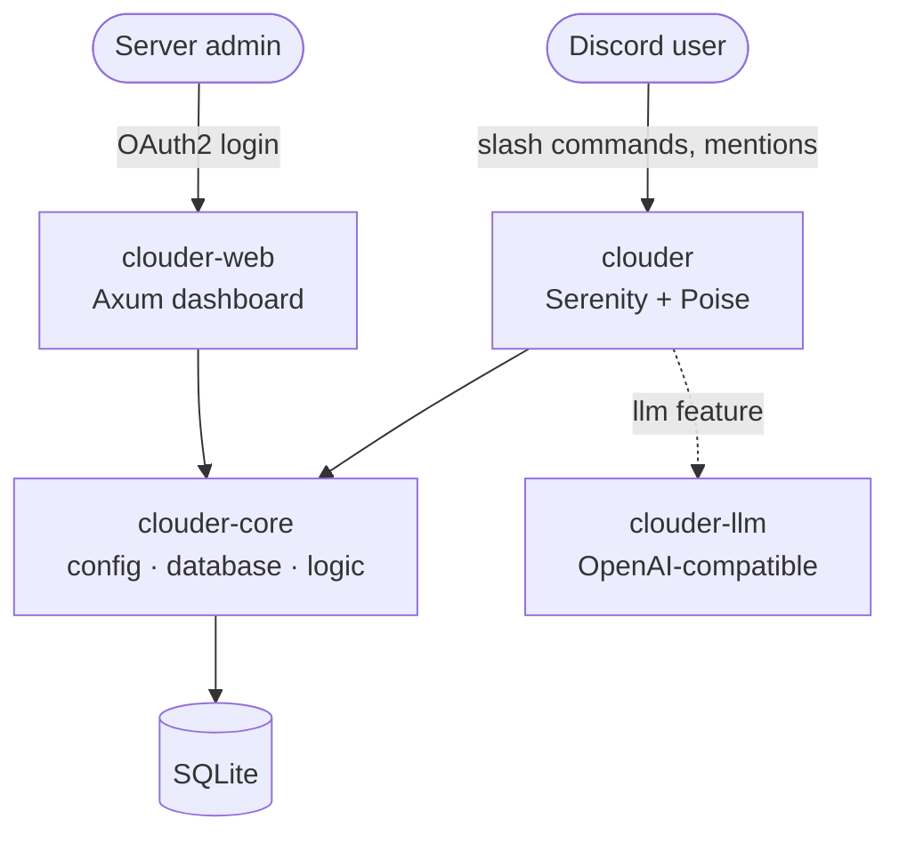

<div align="center">

# ☁️ clouder

**A modular Discord bot written in Rust.**

Slash commands, a web dashboard, LLM chat, self-roles, and scheduled reminders, all in one binary.

[](https://www.rust-lang.org/)
[](https://github.com/serenity-rs/serenity)
[](https://github.com/tokio-rs/axum)
[](https://www.sqlite.org/)
[](https://github.com/uwuclxdy/clouder/releases)

[**Quickstart**](#-quickstart) · [**Commands**](#%EF%B8%8F-commands) · [**Wiki**](https://github.com/uwuclxdy/clouder/wiki) · [**Configuration**](https://github.com/uwuclxdy/clouder/wiki/Configuration)

</div>

---

clouder runs the bot, the web dashboard, and the reminder scheduler in a single process. `web` and `llm`
are feature flags, so you can ship the full stack or just the bot.

## ✨ Highlights

| Feature | What it does |
|---|---|
| **LLM integration** | Replies to `@mentions` via any OpenAI-compatible provider, with a per-user whitelist and cooldowns |
| **Web dashboard** | Axum REST API behind Discord OAuth2 with signed session cookies |
| **Self-roles** | Button-driven role assignment with cooldowns, configured from the dashboard |
| **Media-only channels** | Auto-deletes non-media messages, with per-channel content rules |
| **Welcome / goodbye** | Configurable join and leave messages with `{user}`, `{server}`, `{member_count}` placeholders |
| **Reminders** | Scheduled reminders with timezone support and channel or DM delivery |
| **Fun extras** | `/uwufy`, `/random`, `/tinyfox`, GitHub and HuggingFace lookups |

## 🚀 Quickstart

> [!NOTE]
> Needs **Rust (edition 2024)**; SQLite is bundled. clouder needs three generated secrets, all distinct: `SESSION_SECRET`, `API_KEY_PEPPER`, `OAUTH_ENCRYPTION_KEY`.

1. Clone the repo and copy the env template.
2. Fill `DISCORD_TOKEN`, `DISCORD_CLIENT_ID`, `DISCORD_CLIENT_SECRET`, and `BOT_OWNER` in `.env`.
3. Generate each web secret with `openssl rand -hex 32` and paste it into `.env`.
4. Build and run.

```sh
git clone https://github.com/uwuclxdy/clouder.git
cd clouder
cp .env.example .env
openssl rand -hex 32    # SESSION_SECRET
openssl rand -hex 32    # API_KEY_PEPPER
openssl rand -hex 32    # OAUTH_ENCRYPTION_KEY
cargo build --release
./target/release/clouder
```

If `.env` is missing, clouder writes one from `.env.example` and exits, fill it in and rerun. With `.env`
in place, the first run creates `data/db.sqlite`, applies all migrations, and registers slash commands globally.

Want bot-only or a different mix? See the [feature matrix](https://github.com/uwuclxdy/clouder/wiki/Installation#feature-matrix).

## 🧩 Architecture



| Crate | Role |
|-------|------|
| `clouder` | Bot binary: runtime, slash commands, event handlers, scheduler |
| `clouder-core` | Shared library: config, database, business logic, external API clients, utilities |
| `clouder-llm` | OpenAI-compatible LLM client *(feature: `llm`)* |
| `clouder-web` | Axum web dashboard and REST API *(feature: `web`)* |

## 🎛️ Commands

| Command | What it does |
|---------|--------------|
| `/about bot \| server \| user \| role \| channel` | Info and live stats (uptime, RAM, CPU, latency) |
| `/help [category]` | List commands by category |
| `/selfroles` | Open the self-role dashboard *(Manage Roles)* |
| `/purge <count \| message_id>` | Bulk-delete messages *(Manage Messages)* |
| `/mediaonly <channel> [enabled]` | Toggle media-only mode *(Manage Channels)* |
| `/reminders` | View active reminders |
| `/github <user> [repo]` · `/gh-trending` · `/hf` | GitHub and HuggingFace lookups |
| `/uwufy [user]` · `/random` · `/tinyfox` | Fun extras |

Full table with permissions: [**Commands**](https://github.com/uwuclxdy/clouder/wiki/Commands) wiki page.

## 📚 Documentation

The wiki holds the full reference. Start at the [**Home page**](https://github.com/uwuclxdy/clouder/wiki).

| Page | Covers |
|------|--------|
| [Installation](https://github.com/uwuclxdy/clouder/wiki/Installation) | Prerequisites, build, run, feature matrix, Discord permissions and intents |
| [Configuration](https://github.com/uwuclxdy/clouder/wiki/Configuration) | Every environment variable, secrets, LLM and scheduler settings |
| [Commands](https://github.com/uwuclxdy/clouder/wiki/Commands) | Full command reference with required permissions |
| [Features](https://github.com/uwuclxdy/clouder/wiki/Features) | How each feature behaves |
| [Web Dashboard](https://github.com/uwuclxdy/clouder/wiki/Web-Dashboard) | OAuth2 flow and REST API endpoints |
| [Architecture](https://github.com/uwuclxdy/clouder/wiki/Architecture) | Crates, modules, `AppState`, background tasks |
| [Database](https://github.com/uwuclxdy/clouder/wiki/Database) | Schema, tables, migrations |

## 🔧 Configuration

clouder reads its config from `.env`. The four Discord values plus the three web secrets are required;
LLM, GitHub, embed color, and scheduler settings are optional. See the
[**Configuration**](https://github.com/uwuclxdy/clouder/wiki/Configuration) page for the full reference.

## 📄 License

[MIT](LICENSE)

---

<div align="center">
<sub>Built with 🦀 Rust, Serenity, Poise, and Axum.</sub>
</div>
