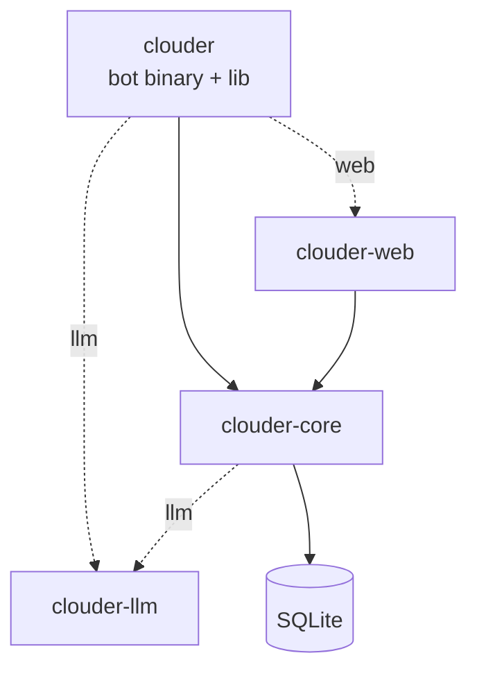

# Architecture

clouder is a Cargo workspace of four crates. The bot binary owns the runtime; everything else is a library.

## Crates and dependency graph



| Crate | Role | Feature |
|-------|------|---------|
| `clouder` | Bot binary and library: runtime, commands, events, scheduler | always |
| `clouder-core` | Config, database, business logic, external API clients, utilities | always |
| `clouder-llm` | OpenAI-compatible LLM client (reqwest, serde, anyhow) | `llm` |
| `clouder-web` | Axum dashboard and REST API | `web` |

`clouder-llm` carries no tokio dependency; it runs on the caller's async runtime.

## Startup sequence

`main.rs` calls `clouder::run()`. `run()` first checks for `.env`: if missing, it writes one from
`.env.example`, prints an instruction, and exits. Otherwise it spawns a tokio runtime and runs
`async_main()`, in this order:

1. Load `.env` (`dotenvy`) and initialize logging.
2. Load `Config::from_env()`.
3. `initialize_database()`: create `data/` and the SQLite file if missing, then run migrations.
4. Build the Poise framework: the command list and event handler are declared here. Its `setup` closure
   registers commands globally (`register_globally`), builds an `AppState`, and stores it in the Serenity
   TypeMap for event handlers.
5. Build the Serenity client.
6. Build a second `AppState` for the background tasks and the web server.
7. Start background tasks: cooldown/session cleanup and the reminder scheduler.
8. Run the Serenity client and `clouder_web::run(app_state)` concurrently via `try_join!` (when `web`).

## AppState

`AppState` is the Poise `Data` type and the Axum `State`. It flows through every command, event handler,
and web route.

```rust
pub struct AppState {
    pub config: Arc<Config>,
    pub db: Arc<SqlitePool>,
    pub http: Arc<Http>,
    #[cfg(feature = "llm")]
    pub llm_client: Option<clouder_llm::LlmClient>,  // Some when LLM_PROVIDER is set
}
```

`Config` holds `discord: DiscordConfig`, `web: WebConfig` (with `oauth: OAuthConfig`, `embed: EmbedConfig`,
and the three secrets), `database: DatabaseConfig`, `llm: LlmConfig`, plus top-level `github_token`,
`scheduler_interval`, and `default_timezone`. See [Configuration](Configuration).

## Feature wiring

```toml
[features]
default = ["web", "llm"]
web = ["dep:clouder-web"]
llm = ["clouder-llm", "clouder-core/llm"]
```

## Module layout (`clouder`)

```
src/
  lib.rs          crate root, public re-exports, run() + async_main()
  main.rs         thin binary entry point
  logging.rs      tracing-subscriber init
  scheduler.rs    reminder scheduler loop
  commands/       about, channel, github, github_trending, help, huggingface,
                  mediaonly, purge, random, reminders, selfroles, tinyfox, uwufy
  events/         bot_mentioned, mediaonly_handler, member_events,
                  message_handler, selfroles
  tests/          per-module test files
```

## clouder-core layers

```
lib.rs
  config.rs       AppState, Config hierarchy, env loading
  crypto.rs       AES-256-GCM / HMAC helpers for the dashboard
  database/       dashboard_sessions, dashboard_users, guild_cache, guild_configs,
                  mediaonly, reminders, selfroles, uwufy, welcome_goodbye + migration runner
  external/       third-party API clients: github, github_trending, huggingface, tinyfox
  shared/         business logic orchestrator (mod.rs) + DTO models (models.rs)
  utils/          embed color, permissions, timestamps, content_detection, welcome_goodbye
```

### shared (orchestration)

`shared/mod.rs` sits at the top of `clouder-core`. Its functions coordinate database access, Discord API
calls, and utilities. Both the bot commands and the [web endpoints](Web-Dashboard#json-api) call into it,
so validation and side effects stay in one place.

## Background tasks

| Task | Cadence | What it does |
|------|---------|--------------|
| Cleanup | every 5 minutes | Purges expired self-role cooldowns and expired dashboard sessions |
| Reminder scheduler | `SCHEDULER_INTERVAL` (default 60s) | Sends due reminders, with a ~55s debounce so each fires once |
| Web session sweep | every 15 minutes | The dashboard separately deletes expired `dashboard_sessions` rows |

## Type aliases

```rust
type Data = AppState;   // Poise framework data type
type Error = Box<dyn std::error::Error + Send + Sync>;
```
